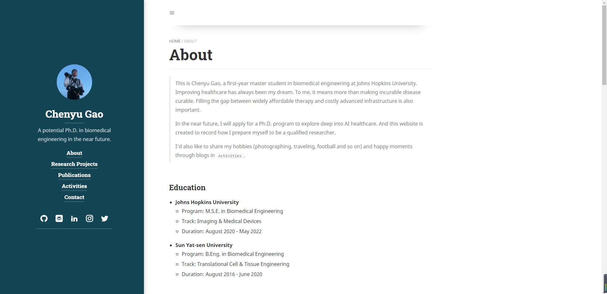

# About Me

This is Chenyu Gao, 
a first-year master student in biomedical engineering at Johns Hopkins University.
Improving healthcare has always been my dream. 
To me, it means more than making incurable disease curable.
Filling the gap between widely affordable therapy and costly advanced infrastructure is also important.

In the near future, I will apply for a Ph.D. program to explore deep into AI healthcare.
And this website is created to record how I prepare myself to be a qualified researcher.

I'd also like to share my hobbies (photographing, traveling, football and so on) 
and happy moments through blogs in `Activities`.

# About Hydejack

This personal website is powered by [Hydejack](https://hydejack.com/), 
an easy and free to use Jekyll theme created by @qwtel.

The free version can be downloaded [here]()
