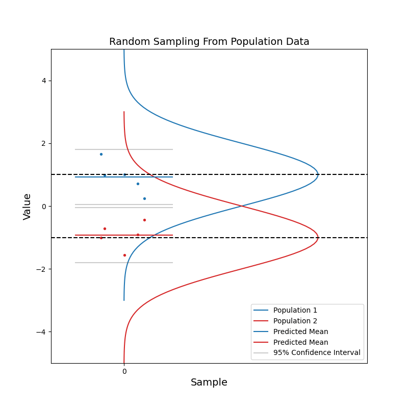

We've seen 95% confidence intervals over and over again. Here are some examples in linear regression senarios.

### What do 95% confidence intervals tell us?

To my knowledge, we can say that 95% of chance, the unknown parameter that we are estimating should fall between the confidence intervals.

### Let's explain this through simulations.

Say we have a large population. The population consists of billions of data points, whose values follow a normal distribution. Each time, we take a random sample from the population. We calculate the mean of values of this random sample as our estimate for the mean of the population. We also calculate and plot the 95% confidence intervals. With these 95% confidence intervals we can say, hey, there is 95% of chance that the mean of the population should fall in this range.

From the simulation, we can see, the horizontal lines for the mean calculated from the random sample and the 95% confidence intervals are jumping up and down, but in most cases, the population mean is contained within the confidence interval. With increasing sample size, the confidence interval becomes narrower. And the estimated mean gets closer to the population mean on average. In other words, the estimation becomes more confident.

Now consider when we have data coming from two populations. Like before, we sample a number of data points from each population. 

With a small sample size, we see that the two sets of confidence intervals often overlap with each other. And as sample size increases, the confidence intervals get narrower, and the probability of overlapping becomes smaller.

When the two sets of 95% confidence intervals do not overlap, there is a key information we can get by just looking at the figure: there is a statistically significant difference in the values of data from the two population. We know the pvalue is smaller than 0.05 just by looking at this figure.

Through this simple one-dimensional simulation, we know how to interpret the confidence intervals now. 
